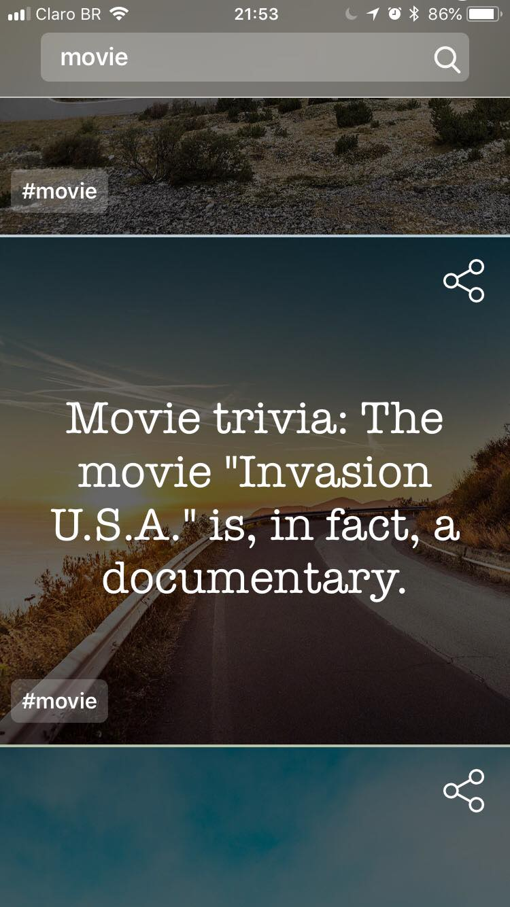
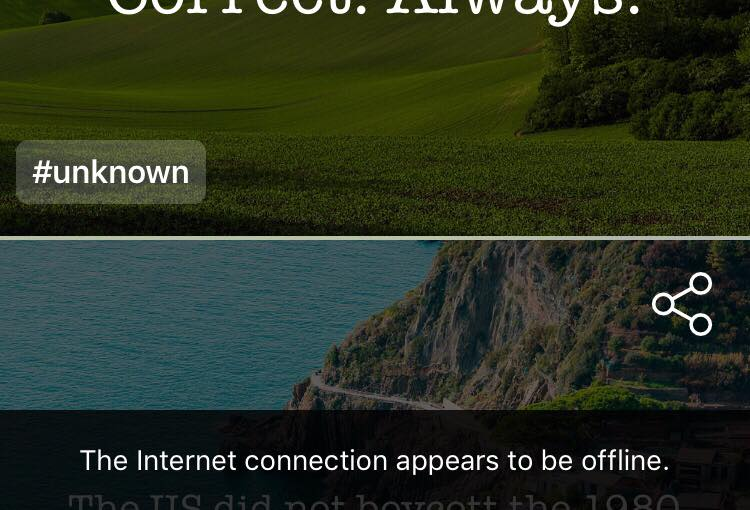

# InstaNorris

Insta Norris is the best app to have a laugh on the most awesome Chuck Norris Facts, ready to be shared to your favorite social network!

For the InstaNorris, I was inspired by those “landscape” with those random motivational quotes. I find them funny :p

## Architecture

The architecture used to build InstaNorris app is **MVVM**, with helping hands from **RxSwift**. Each view is a separate module, with its own **_.xib_**, **_view_** and **_view model_**.

The navigation is handled by a **coordinator**. It is responsable to remove navigation logic from each view and have them all in just one place. If the app handles a lot of different flows of navigation, it can become quite handy.

### View Models
The view models are responsible for all logic, and the views should only reflect the view model states (basicaly, just binds!). To enforce this, all view model properties are `let` constants, and all of them are created on `init()`. For example:

	class ViewModel {
		
		let myState: Driver<Bool>
		
		init() {
			myState = Driver.just(true)
		}
		
	} 
	
This has some pros and cons. On the pros, it is not dependent of any ordering, like using binding functions and `var` that can be `nil`. On the other hand, there isn't really a way of actually unit testing the properties, but it is still possible to test their behaviours working properly.

### Libraries

Don't reinvent the wheel! The libraries used in this project includes:

* **Swinject**: Handles dependency injection
* **Moya**: A wraper of Alamofire for API calls
* **SwiftLint**: Enforce coding styles
* **Lottie**: Awesome animations
* **KIF**: UI Tests made simple
* **Quick** & **Nimble**: Human readable testing

## Highlights
### Long Facts

The hole idea of the app was to have Instagram-like facts, square images ready to be shared. But some facts are a lot longer and do not fit in the square! 

How did I solve this problem, without having to do a ton of code? The power of **constraints**, of course. The item layout has a view with an 1:1 aspect ratio constraint, that will keep them square, but also have the text pinned to top and bottom of the layout. By changing the 1:1 aspect ratio constraint priority to a lower number, if the text is longer, this constraint have less priority and breaks, leaving space for the text to grow as necessary

### xCode Templates
	
When we chose an architecture to follow, we have this “standart” on how view, viewModels, etc, are supposed to look like. That means a lot of copy and paste each time we need to create a new “pack” of things. By creating xCode templates we can enforce style and save time avoiding copy and paste!

### Interactive Animations

I’m a suspect, I love Property Animators! I have talked about them in March’s CWB CocoaHeads and The Developers Conference (Florianópolis). They can elevate the level of user interaction in an app and increase the app awesomeness (hard to measure, easy to like). Property animators were used in the header and the Onboarding view. 

### Components

Creating view components are always helpful to separate view logic, have cleaner view controllers and increase reusability. For this project, a few components were created, for example

* **HeaderView**: holds the hole header and separates animation logic into component
* **CloudTagView**: holds a collection view for tags, reused 3 times in the app - in categories, recent search and showing each fact category
* **StateView**: responsable for rendering the possible view states we might have, like loading, empty or error view

### Non-interrupting errors:

Showing errors to the user are usually not good, but very important to make it the best experience possible. When user has no content available, it is ok to show a full screen error - but what about when there was already some content showing? Non-interrupting errors are a way of showing the errors when content available, a feature of this app :)

	Developed with ❤️ by Aline Borges